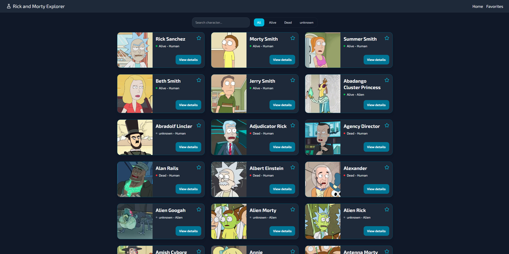
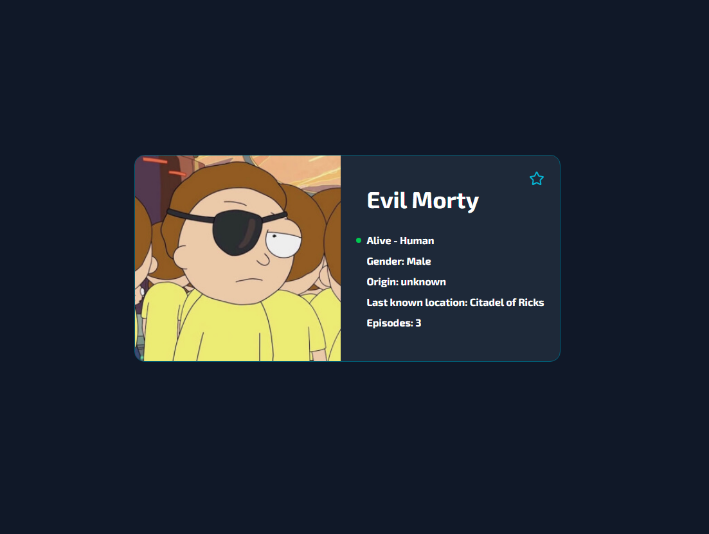
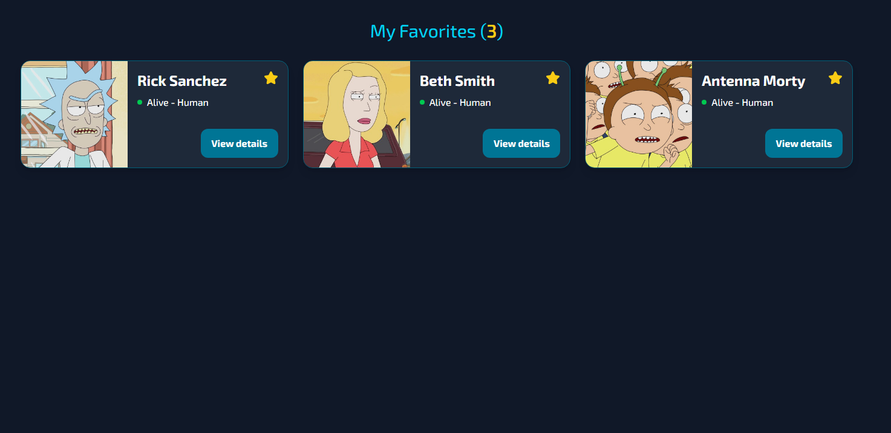

# 🛸 Rick and Morty Explorer

A responsive web application built with React and TypeScript that consumes the public Rick and Morty API to explore characters, view detailed profiles, and manage favorites.

The project was created to practice modern front-end concepts such as componentization, custom hooks, state management with Context API, API consumption with filters and pagination, and styling with Tailwind CSS.

---

## 🌐 Live Demo

🔗 [Rick and Morty Explorer](https://rick-and-morty-explorer-theta.vercel.app/)

---

## 🚀 Tech Stack

-  **React**
-  **TypeScript**
-  **Vite**
-  **Tailwind CSS**
-  **React Router DOM**
- ⚛️ **Context API**
- 🛸 **Rick and Morty API**
- 💾 **LocalStorage**

---

## ✨ Features

### 1. 🔍 Character exploration

- Search by name with debounce — no unnecessary requests on every keystroke
- Filter by status: All, Alive, Dead or Unknown
- Combined search and filter working simultaneously
- Pagination with previous and next controls
- Skeleton loading during data fetching

### 2. 👤 Character details

- Image, name, status, species, gender, origin, location and episode count
- Favorite/unfavorite button directly on the details page

### 3. ⭐ Favorites system

- Add and remove characters from favorites on any page
- Persistence with LocalStorage — favorites survive page reloads
- Dedicated page to manage favorites

### 4. 📱 Responsive design

- Layout adapted for mobile, tablet and desktop

### 5. ⚠️ State handling

- Skeleton loading during API requests
- Friendly messages for error and empty states
- 404 page for unknown routes

---

## 📸 Preview





---

## 📦 Getting Started

```bash
# Clone the repository
git clone https://github.com/arturbnardo/rick-and-morty-explorer.git

# Navigate to the frontend folder
cd rick-and-morty-explorer/frontend

# Install dependencies
npm install

# Start the development server
npm run dev
```

---

## 👤 Author

**Artur Bernardo**

- GitHub: [@arturbnardo](https://github.com/arturbnardo)
- LinkedIn: [arturbnardo](https://www.linkedin.com/in/arturbnardo/)
